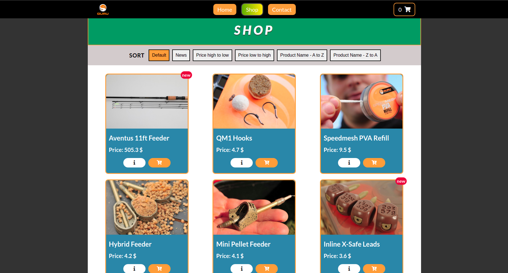

# Guru
Fishing online store. Education and portfolio project: [LINK](https://guru-shop.herokuapp.com/)

**DOCUMENTATION**: [LINK](https://tomaszjarkowski.github.io/guru/)
**BACKEND CODE**: [LINK](https://github.com/TomaszJarkowski/guru-backend)



## General information :page_facing_up:

The Guru online store is a website created for learning. The website was built using the MERN stack. Before starting the project, some requirements for creating this page were set, these requirements are at the bottom of the readme. You can add products to the basket, fill out the order form and place an order, you can also subscribe to our newsletter or read our articles. In the basket, we can remove products, increase and decrease their quantity, and also go to the next stage, which is "Order". The site is also connected to YouTube and the last 4 videos are displayed.


## Getting Started :envelope_with_arrow:

See the program operation in the link below or download the project, download it to your computer. Then follow the instructions. (Instead of downloading the project, you can also use the **git clone** command)

### Installing :open_file_folder:

Create an "**.env**" file in the project's root directory, then copy the entire contents of the "**.env.tpl**" file and paste it into "**.env**" and replace "**URL**" with the correct paths

To initiate the project, enter in the terminal:

```
npm install
```

Build the client, enter in the terminal:

```
npm run build
```

To start a live server, enter in the terminal:

```
npm start
```

Start project by **Docker**

```
docker build -t guru .
```

```
docker run -p 8000:8080 guru
```

## Core technologies :rocket:

* React.js
* Typescript
* Redux
* SCSS 
## Additional technologies :link:

* Axios
* Yup
* @reduxjs/toolkit
* React-router
* React-hook-form
* React-tooltip
* React-toastify
* React Portal
* Docker
* Testing-library
* Sentry

## Customer Requirements :bulb:

- [x] Each product has its own page 
- [x] The product may have the status "new"
- [x] The ability to sort products
- [x] The ability to paginate products
- [x] Notification after adding the product to the cart
- [x] Show the last 4 videos from YT on main page
- [x] There are products with the status "new" on the home page
- [x] Form for subscribing to the newsletter
- [x] Each article has its own page
- [x] Multi-step form
- [x] You can go back to the last steo in the multi-step form
- [x] After hovering over the input, a tooltip with the requirements appears in the form
- [x] If you are placing an order and want to leave the page, a warning should appear
- [x] After correctly placing the order, you are redirected to the finish page
- [x] If the path is incorrect, an error page should appear
- [x] Sticky menu
- [x] Dockerize app
- [x] Unit tests
- [x] Application monitoring and error tracking
- [ ] Payment
- [ ] Admin panel
- [ ] PWA

## Author :poland:

- **Jarkowski Tomasz** 

## License :closed_book:

For personal use only. Do not distribute.