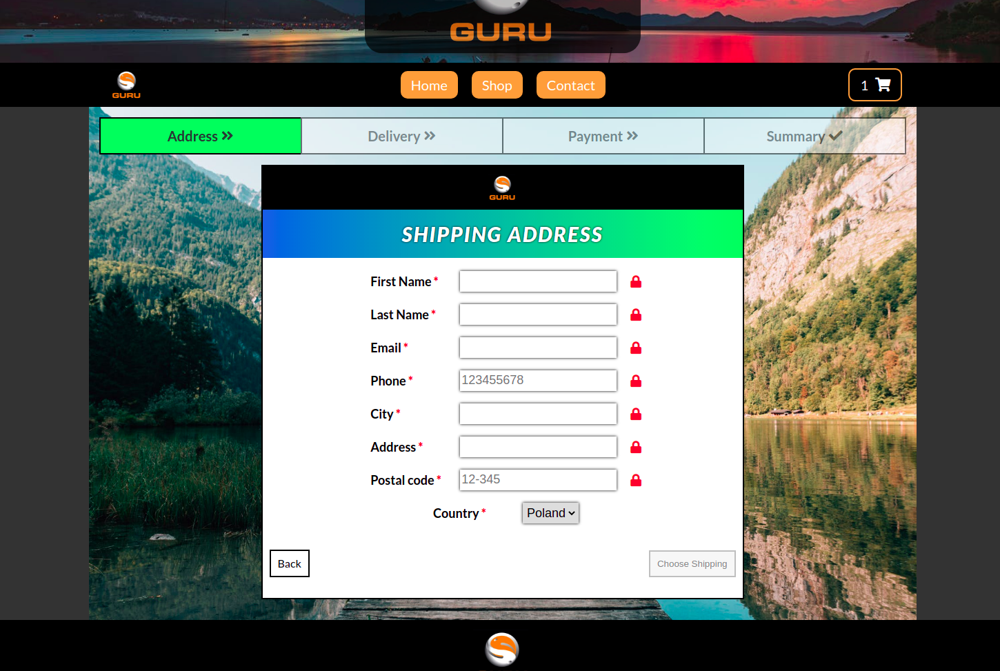

# General information :page_facing_up:

The Guru online store is a website created for learning. The website was built using the MERN stack. Before starting the project, some requirements for creating this page were set, these requirements are at the bottom of the readme. You can add products to the basket, fill out the order form and place an order, you can also subscribe to our newsletter or read our articles. In the basket, we can remove products, increase and decrease their quantity, and also go to the next stage, which is "Order". The site is also connected to YouTube and the last 4 videos are displayed.

